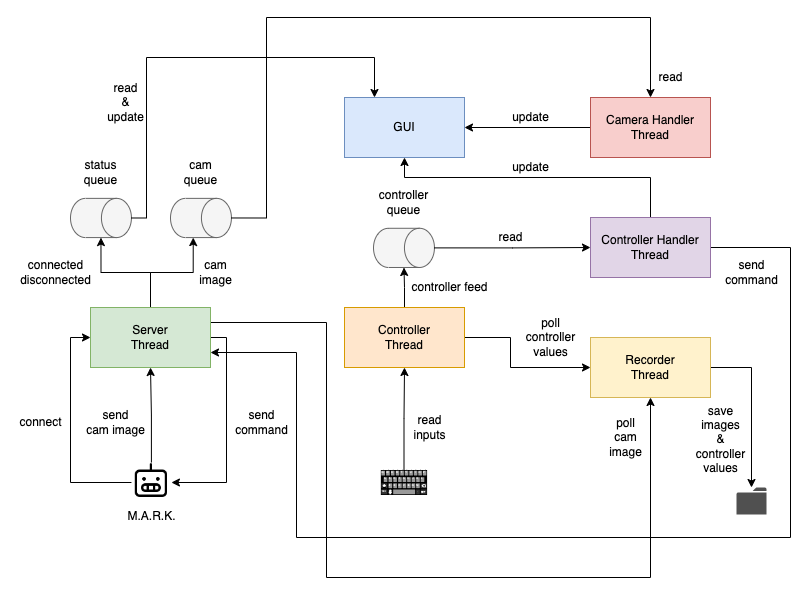

# mark_app

An app for controlling M.A.R.K.


## Dependencies

### Python Environment

This app was developed for Python 3.7+. We also use [Poetry](https://python-poetry.org/) for dependency management. Install all dependencies by running `poetry install`.

### Inputs

This app requires the [`inputs`](https://github.com/zeth/inputs) library to be installed manually. The reason is that the latest release doesn't include some important fixes present in the repository. To install manually, follow these steps:

```
git clone https://github.com/zeth/inputs.git
cd inputs
python setup.py install
```

### QR Code

To generate QR codes with the WiFi information of the server, we use `qrencode`. Install on Mac using `brew install qrencode` or on Linux using `apt-get install qrencode`.

## Features

- Visualizing the real-time feed from the robot's camera
- Controlling the robot using keyboard, with the following bindings
  - `W`: Move forward
  - `A`: Turn left
  - `S`: Move backward
  - `D`: Turn right
  - `UP ARROW`: Tilt camera up
  - `DOWN ARROW`: Tilt camera down
  - `LEFT ARROW`: Pan camera left
  - `RIGHT ARROW`: Pan camera right
  - `O`: Open gripper
  - `P`: Close gripper
- Visualizing the controller feed as a plot
- Recording camera images along with controller values
  - Images are saved as `png` files
  - A `csv` file is generated with camera-controller feed pairs per record

## Connecting M.A.R.K. to the app

### Configuration

To connect the robot to the app, first make sure to deploy the custom configuration scripts, `boot.py` and `remote.py`, to M.A.R.K. These scripts are available inside the `config` folder of this repo.

> Note: These scripts can be deployed using [uPyLoader](https://github.com/BetaRavener/uPyLoader).

### WiFi QR Code

We also need to generate a QR code to encode the WiFi information of the server. This is the way network information is shared with M.A.R.K.

To create the QR code use the following command:

```
qrencode -o wifi.png -s 10 '{"ssid":"[WIFI_NAME]","password":"[WIFI_PASSWORD]","host":"[SERVER_IP]","port":1060}'
```

To quickly find the server IP address, run the following:

```
python -c "import socket; print(socket.gethostbyname(socket.gethostname()))"
```

In order for the app to find this QR code, save the `wifi.png` image to the `img/` folder.

### Establishing the connection

Finally, to connect to the app, follow these steps:

1. Turn on M.A.R.K. and immediately press the `boot` button **3 or more times**
   - This button is next to the `reset` button at the back of the robot
   - If done successfully, a message should appear on the robot's display: "Entering remote mode..."
2. After entering remote mode, wait for the camera to turn on
3. Start the app by running `python app.py`
4. Click on the **WiFi QR Code** button on the app
   - A popup should appear with the QR code generated previously
5. Point M.A.R.K.'s camera to the QR code and wait for it to detect it
   - The display will freeze temporarily when the code has been detected it
6. Wait for the robot to parse the QR code and connect to the server
7. If successful, the app will show an **Online** status and the camera feed should start displaying automatically
8. M.A.R.K. is now connected and can be controlled using the keyboard

## Troubleshooting

### Constant reconnections

If you notice that M.A.R.K. keeps disconnecting and connecting again to the app, it is completely expected. The socket on the robot's side is a little finicky, and won't keep the connection open. This causes the camera feed to pause for a fraction of a second, but we couldn't figure out a way of keeping the connection stable.

### M.A.R.K. disconnected and the app is frozen

If the robot completely disconnects, e.g. if you turn it off, the app will appear to be frozen. In particular, the camera feed will display the last image, and the status will remain as "Online". Just click the **Reset** button, and the app will be ready again to receive a connection from M.A.R.K.

## Appendix

### Architecture

The following diagram shows the overall architecture of the app, and how information flows between the different components and the robot.

<p align="center">
  
</p>
